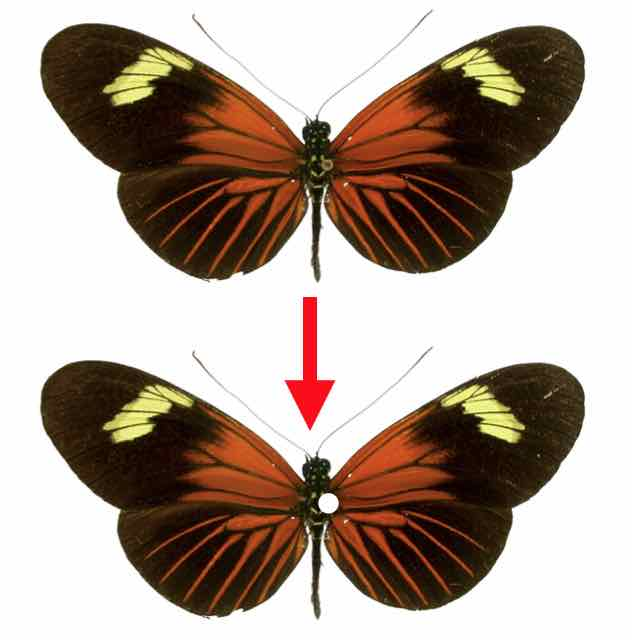

* Introduction to `colordistance`
* [Color Spaces](color-spaces.html)
* [Pixel Binning Methods](binning-methods.html)
* [Color Distance Metrics](color-metrics.html)
* [CIELab Analyses](lab-analyses.html)

The `colordistance` package contains functions for quantifying the differences between colorful objects. It was originally written for comparing coral reef fishes, but is appropriate for any question that requires objectively measuring the color similarity of two or more objects. For example, say you find three flowers -- a red one, an orange one, and a blue one. Based just on their colors, you could safely say that the red and orange flowers are more similar to each other than either one is to the blue flower. But what if the orange flower has blue spots? Obviously it's more like the blue flower than the solid orange flower would be, but by how much? What if the blue flower also has red spots? What was an obvious comparison previously now becomes more of a judgment call if we really entirely on human classification.

The functions in `colordistance` were written in order to provide simple, scaleable metrics for providing quantitative answers to these kinds of problems. An image of a colorful object is treated as a set of three-dimensional points, where each pixel in the object is a coordinate in either [RGB](https://en.wikipedia.org/wiki/RGB_color_space) or [HSV](https://en.wikipedia.org/wiki/HSL_and_HSV) color space. These pixel coordinates are binned, and the locations and sizes of the bins making up different images are compared to measure their color similarities.

Although there are several different methods provided in the package, the basic steps of the analysis are consistent:

1. Obtain images of objects on uniform-color backgrounds

1. Bin every (non-background) pixel into color categories

1. Measure the differences in the bins for each pair of images

This package provides several options both for binning pixels and comparing the bins; explanations of these methods and their implications for analysis are provided in other vignettes. The following example, comparing images of *Heliconius* butterflies, is designed to illustrate the basic steps outlined above using real data.

## Acquiring and prepping images

Butterflies in the *Heliconius* genus are famous for their visual mimicry -- unpalatable species resemble each other in order to amplify the effect of warning coloration for predators of either species, and palatable species mimic unpalatable ones to the same effect.

```{r, echo=F, fig.align="center", fig.cap="Eight different species of *Heliconius* butterflies; from @Meyer2006.", out.width="500px"}
knitr::include_graphics("Heliconius_mimicry.jpg")
```

So, knowing that appearances are particularly important for these butterflies, let's figure out just how good these mimics are. Which pair of mimics scores the highest similarity? The image above (also available [here](https://en.wikipedia.org/wiki/Heliconius#/media/File:Heliconius_mimicry.png)) is perfect for our analysis -- the butterflies were clearly photographed under identical conditions, the lighting appears even, and the specimens were all photographed from the same angle. 

First we need to break them up so that each butterfly has its own photograph (easily accomplished by cropping copies). Then we need to make sure that everything we don't want to count as part of the butterfly coloration is a **single, uniform background color**, preferably one as dissimilar to the object colors as possible, so that we can tell `colordistance` which pixels to ignore when we get to that stage. Luckily almost every non-butterfly thing has been colored in white, which makes this part easier -- just about all we have to get rid of is the pin in the thorax:

```{r, echo=F, fig.align="center", fig.cap="The pin is small, but since it's not a part of the butterfly, we should exclude it.", out.width="250px"}

```

Any image editing software can accomplish this -- [GIMP](https://www.gimp.org/) is a popular, free option. In most cases, photos won't already have a uniform background, so the object or region of interest will have to be segmented out by hand, and the background bucket filled with a background color. By the end of this step, we have 8 images of one object (a butterfly) each, where everything that's not a part of the animal is a uniform, easily specified background color. (Note that each picture in the dataset should have the *same* background color.)

## Loading the images into R 

`colordistance` treats pixels as three-dimensional coordinates in either RGB or HSV 'color space' -- think of each of the R, G, and B channels as equivalent to the X, Y, and Z planes in a conventional 3D coordinate system. To get a better idea of this, you can use the `plotPixels()` function to plot the pixels in an image as if they were coordinates in color space; each pixel's location is determined by its color, and the point itself remains the same color it was in the original image:

```{r, fig.width=5, fig.height=4, fig.align="center", fig.cap="(Note that `plotPixels()` plots a randomly selected subset of the pixels by default in an image to make it easier to see.)"}
Heliconius_08 <- system.file("extdata", "Heliconius/Heliconius_B/Heliconius_08.jpeg", package="colordistance")
colordistance::plotPixels(Heliconius_08, lower=NULL, upper=NULL)
```

We can clearly see the black, red, and yellow pixels that make up the butterfly's colors, as well as a tight cluster in the upper right of white pixels which make up the background. Note that the black pixels are clustered near the [0, 0, 0] coordinate, while the white ones are around [1, 1, 1], making them as far away from each other as possible. The white background pixels -- which should be excluded from the analysis -- are included because we set the `lower` and `upper` bounds for the background pixels to `NULL`, meaning no pixels were ignored. 

`colordistance` comes with a `loadImage()` function which imports an image and returns both the original image as a pixel matrix and a matrix with all the background pixels removed. In order for that to work, you have to tell it the range for the background pixels as upper and lower limits for the RGB values. Our background color is white, which we can see above means most of the background pixels are centered around [1, 1, 1]. Since image compression is rarely perfect, however, not every white pixel is exactly [1, 1, 1], so we'll specify a *range* for the background pixels:

```{r}
lower <- c(0.99, 0.99, 0.99)
upper <- c(1, 1, 1)
H8 <- colordistance::loadImage(Heliconius_08, lower=lower, upper=upper)
```

The `lower` and `upper` vectors specified here are lower and upper limits for each of the R, G, and B channels. Only pixels where the red value, the green value, **and** the blue value are all between 0.99 and 1 will be counted as background, so a very pale grey [0.99, 0.99, 0.99] pixel would be eliminated, but a pixel with the value [1, 1, 0.5] (yellow) would not be eliminated because the blue value is lower than the lower limit of 0.99. 

Let's check what `loadImage()` returns:

```{r}
names(H8)
```

There are four attributes to the `H8` list: the path to the original image, the original RGB image, and a matrix of all the non-background pixels, both in the original RGB format and as converted to HSV if you choose to use that instead.

```{r}
dim(H8$original.rgb)
dim(H8$filtered.rgb.2d)
```

We can see that the original image is 285 by 577 pixels, with 3 layers (red, green, and blue). This gives us a total of 331*584 = 164,445 pixels, but our filtered 2D matrix contains only 101,204 pixels -- meaning the other ~63,000 pixels in the image were classified as background and ignored.

Sounds promising, but it's difficult to tell how effective the thresholds are from the numeric matrix. Before doing any color binning or analysis, we can also plot all the non-background pixels we just identified to see if any white pixels got through:

```{r, fig.width=5, fig.height=4, fig.align="center"}
colordistance::plotPixels(H8)
```

Looks mostly fine, but there's clearly still a cluster of off-white pixels up in the top right that should be ignored. In order to catch them, the lower limits should be widened:

```{r, fig.width=5, fig.height=4, fig.align="center"}
lower <- rep(0.8, 3)
colordistance::plotPixels(Heliconius_08, lower=lower, upper=upper)
```

Finding effective upper and lower limits can come down to a judgment call of sensitivity versus specificity, especially if the object in the image has patches of color similar to the background. In this case, it seems that nearly all of the white pixels are eliminated, and we haven't eliminated the pixels that we can clearly see on the butterfly's wings, so these bounds are effective. 

```{r}
lower <- rep(0.8, 3)
upper <- rep(1, 3)
H8 <- colordistance::loadImage(Heliconius_08, lower=lower, upper=upper)
dim(H8$filtered.rgb.2d)
```

We eliminated about another 10,000 pixels in the white range -- enough to have seriously skewed results if they'd remained, since it would have suggested that a red, black, and yellow butterfly was 10% bright white!

Note that the analysis will still run if you don't specify background pixel ranges -- the default ranges are set for bright green (the classic "green screen" value of [0, 1, 0]), but if you set one or both to `NULL`, no pixels will be removed. 

## Binning the pixels

Now that we have a list of pixels, we need to bin them in order to make comparisons with other images (both for computational efficiency and since images will have different numbers of pixels). `colordistance` provides two major methods for color binning: a histogram method using `getImageHist()`  (predetermined bins) and a k-means clustering method using `getKMeanColors()` (tries to find centers that minimize the distances between pixels and their assigned centers). 

The differences between the two methods can be pretty dramatic, but I strongly recommend the first method: if your images contain accent colors or small details, k-means can end up muting those differences since those pixels don't contribute much to the overall pixel-center distances.

The differences in binning methods are explained in the [binning vignette](binning-methods.html), but the short explanation for the histogram method is that the color space cube we've been plotting is divided up into a set number of smaller cubes, with pixels in the same cube counting toward that cube's total. For example, if we divided each of the red, green, and blue channels into 2 bins each, we'd have a total of $2^{3} = 8$ possible cubes for the pixels to fall into.

```{r, fig.width=5, fig.height=4, fig.align="center", echo=F, fig.cap=""}
pix <- H8$filtered.rgb.2d[sample(nrow(H8$filtered.rgb.2d), 10000), ]
colExp <- apply(pix, 1, function(x) rgb(x[1], x[2], x[3]))
xlab <- "Red"; ylab <- "Green"; zlab <- "Blue"
s3d <- scatterplot3d::scatterplot3d(pix, pch=20, xlim=c(0,1), ylim=c(0,1), zlim=c(0,1), color=colExp, grid = F, xlab=xlab, ylab=ylab, zlab=zlab)
a <- 0.5
n <- 3
xy1 <- s3d$xyz.convert(rep(0, n), seq(0, 1, length.out = n), rep(a, n))
xy2 <- s3d$xyz.convert(rep(1, n), seq(0, 1, length.out = n), rep(a, n))
xy3 <- s3d$xyz.convert(seq(0, 1, length.out=n), rep(0, n), rep(a, n))
xy4 <- s3d$xyz.convert(seq(0, 1, length.out=n), rep(1, n), rep(a, n))
yz1 <- s3d$xyz.convert(rep(a, n), rep(0, n), seq(0, 1, length.out=n))
yz2 <- s3d$xyz.convert(rep(a, n), rep(1, n), seq(0, 1, length.out=n))
yz3 <- s3d$xyz.convert(rep(a, n), seq(0, 1, length.out=n), rep(0, n))
yz4 <- s3d$xyz.convert(rep(a, n), seq(0, 1, length.out=n), rep(1, n))
xz1 <- s3d$xyz.convert(rep(0, n), rep(a, n), seq(0, 1, length.out=n))
xz2 <- s3d$xyz.convert(rep(1, n), rep(a, n), seq(0, 1, length.out=n))
xz3 <- s3d$xyz.convert(seq(0, 1, length.out=n), rep(a, n), rep(0, n))
xz4 <- s3d$xyz.convert(seq(0, 1, length.out=n), rep(a, n), rep(1, n))
lty <- "solid"
segments(xy1$x, xy1$y, xy2$x, xy2$y, lty=lty)
segments(xy3$x, xy3$y, xy4$x, xy4$y, lty=lty)
segments(yz1$x, yz1$y, yz2$x, yz2$y, lty=lty)
segments(yz3$x, yz3$y, yz4$x, yz4$y, lty=lty)
segments(xz1$x, xz1$y, xz2$x, xz2$y, lty=lty)
segments(xz3$x, xz3$y, xz4$x, xz4$y, lty=lty)
```

It looks like most of the pixels here fall into the lower left cube (RGB all between 0 and 0.5), the lower right cube (R between 0.5 and 1 and B and G between 0 and 0.5), and the upper right cube (RGB all between 0.5 and 1). We can generate these and visualize these counts using `getImageHist()`:

```{r, fig.width=4, fig.height=3, fig.align="center"}
# Using 2 bins per channel as in the above figure
H8hist <- colordistance::getImageHist(Heliconius_08, bins=c(2, 2, 2), lower=lower, upper=upper)
```

By default, `getImageHist()` also takes the average color of all the pixels assigned to a bin, rather than the center of the bin. To bin each image in the butterfly dataset, we can just pass the whole folder of images to `getHistList()`:

```{r, fig.align="center", results=F, fig.width=8, fig.height=5}
images <- dir(system.file("extdata", "Heliconius/", package="colordistance"), full.names=TRUE)
histList <- colordistance::getHistList(images, lower=lower, upper=upper, bins=rep(2, 3), plotting=FALSE, pausing=FALSE)
```

The `plotClusters()` function can be helpful for visualizing the resulting clusters in color space (this generates an interactive, 3D plotly plot).

## Comparing color histograms

With the pixels binned, we can start comparing the histograms across images. 

```{r, fig.align="center", fig.width=7, fig.height=4, echo=F, results=F}
par(mfrow=c(2,4))
histList <- suppressMessages(colordistance::getHistList(images, lower=lower, upper=upper, bins=rep(2, 3), plotting=TRUE, pausing=FALSE))
```

Inspecting these results, you might intuitively say that the images on the top (Heliconius 01 through 04) form a group of black and orange butterflies, and the ones on the bottom (05 through 08) form a group of black, red, and yellow butterflies, but we need to quantify these differences. There are two kinds of information being displayed here: the **color** of each bin and the **size** of each bin, both of which influence the similarity of one bin to another. 

Each image has a fairly large black/dark brown bin (far left), all of which have comparable color, but in Heliconius_03 that bar is only 30% of the image, whereas in Heliconius_08 it's over 70%. The second-to-leftmost bin (defined by having R > 0.5 and G and B < 0.5) for Heliconius_03 and Heliconius_07 is about 15% of the image in each case, but we can see that the Heliconius_03 color is a much more muted orange, while for Heliconius_07 it's a more brightly colored reddish orange, and so on.

`colordistance` comes with four different methods for comparing histograms, each of which has a different method for taking into account both the color and size of each bin; for more information, see either the [comparison vignette](color-metrics.html) or the documentation for `getColorDistanceMatrix()`. 

Each of the histograms displayed above is stored in a variable we called `histList`, which is a list of dataframes, one per image:

```{r}
names(histList)
histList$Heliconius_01
```

The first three columns are the coordinates of each cluster, and the last column represents the relative size of each cluster as a proportion. Note that when the bin has a size of 0, the cluster coordinates are given as the center of the bin, since there were no pixels in that bin to shift the coordinates away from the center. This format (3 cluster coordinate columns + size column) is necessary for using most of the color comparison functions in this package.

Of the four metrics, Earth mover's distance (@Rubner2000) tends to perform best in my experience, although the metric you choose will depend on what you want to prioritize in your analysis. Briefly, the EMD between a pair of histograms is the minimum cost of transforming one distribution into another -- so in 3D color space, it's the amount of work required to move pixels from one image to match those of another image. The farther the pixels are apart in color space or the larger the size discrepancy between clusters, the higher the cost will be.

Regardless what metric you're using, `getColorDistanceMatrix()` is the function for calculating a color distance matrix:

```{r}
CDM <- colordistance::getColorDistanceMatrix(histList, method="emd", plotting=FALSE)
print(CDM)
```

The result is a symmetrical matrix of pairwise comparisons, where each cell is a quantification of the differences between a pair of objects based on their colors. The higher the number is, the more different the two images are. Although the scales for the different distance metrics are different, it is always the case that a higher number corresponds to a larger measured difference between a pair of images.

## Visualizing results

The distance matrix above is useful in that it puts a number on the color differences between images, so that we can quantify how similar objects in those images are, but it's difficult to get an intuitive sense of whether these numbers accurately reflect the qualitative similarities we can see by looking at the images. To visualize the distance matrix, `colordistance` includes a heatmap function wrapper designed to take the distance matrices returned by `getColorDistanceMatrix()`, called `heatmapColorDistance()`.

```{r, fig.align="center", fig.width=7, fig.height=5, fig.cap="Blue cells indicate **higher** similarity (lower distance), while yellow cells indicate **lower** similarity (higher distance)."}
colordistance::heatmapColorDistance(CDM)
```

For the most part, the results reflect what we can see intuitively -- the best-scoring pair are images 05 and 07, mimics so good you can barely tell them apart; the next-best scoring pair are 06 and 08, which are also highly similar. 01-04 don't score nearly as well, and they also clearly don't mimic each other as closely -- in fact, going by color alone, 02 and 03 end up being quite different from the rest of the images because they're the only two butterflies whose wings are less than 50% black. (If the proportions of colors are less important than their presence or absence, then the `"color.dist"` method may be more useful in `getColorDistanceMatrix()`.)

The exact numbers (and therefore the dendrogram shown in the heatmap, which here is more of a visual tool than a meaningful analysis) will change depending on a number of factors, including the binning method, the number of bins chosen, the comparison metric, and any preprocessing done on the images to reduce variation. 

## Exporting data

Once you're happy with your distance matrix, you can export it in your favorite spreadsheet format:

```{r, eval=FALSE}
write.csv(CDM, file = "Heliconius_color_distance_matrix.csv")
```

## Shortcut

The above explanation might be kind of wordy, but the actual pipeline is pretty quick once you decide what you want to do. To get the results above, this is all you have to run:

```{r, fig.align="center", fig.width=8, fig.height=5, eval=FALSE}
# Define upper and lower bounds for background pixels
upper <- rep(1, 3)
lower <- rep(0.8, 3)

# Get histograms for each image and plot the results
par(mfrow=c(2,4))
histList <- colordistance::getHistList(images, lower=lower, upper=upper, bins=2)

# Inspect distance matrix using heatmap
par(mfrow=c(1,1))
CDM <- colordistance::getColorDistanceMatrix(histList, method="emd", plotting = F)

# Export distance matrix
write.csv(CDM, file = "./Heliconius_color_distance_matrix.csv")

```

But if you want to test a bunch of different methods and options, you can use the pipeline function, `imageClusterPipeline()`, making it easy to see the effect of tweaking certain variables on the overall output.

```{r, fig.align="center", fig.width=7, fig.height=5, results=F}
# Default: histogram binning, EMD color distance metric, 3 bins per channel (27 total)
# Note that we get slightly different clustering each time
default <- colordistance::imageClusterPipeline(images, upper = upper, lower = lower)

# Using k-means instead of histogram
kmeansBinning <- colordistance::imageClusterPipeline(images, cluster.method = "kmeans", upper = upper, lower = lower)

# Using chisq instead of emd
chisq <- colordistance::imageClusterPipeline(images, distance.method = "chisq", upper = upper, lower = lower)

# Using HSV instead of RGB
hsvPix <- colordistance::imageClusterPipeline(images, color.space = "hsv", upper = upper, lower = lower)
```

Different options obviously have different effects on the final output, but are not necessarily more or less valid -- the options depend entirely on what kind of comparison is most meaningful for the dataset in question.

## References
